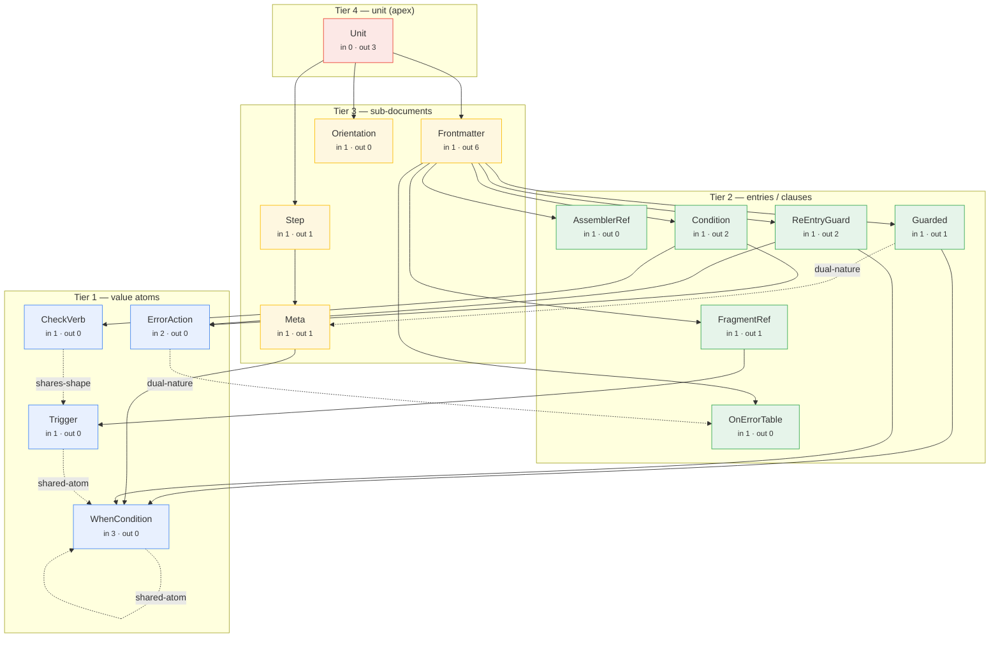

# DSL Type-Graph

A **knowledge graph of the DSL type system** — a visual, navigable map of how the
14 grammar types compose. Built to answer "how are these types linked?" at a
glance, in two granularities:

- **Type-level** (`type-graph.mmd`) — the 15 implementation types
  (`WhenCondition`, `Condition`, `FragmentRef`, `Frontmatter`, `Unit`, …) and how
  they compose. Matches the four-tier model in `docs/dsl-language-guide.md`.
- **Key-level** (`key-graph.mmd`) — the `_`-keys an AUTHOR actually writes
  (`_when`, `_glob`, `_assert`, `_fragments`, `_knowledge`, …), their containment,
  and the closed token sets they draw from.

## The core principle: DERIVE, don't hand-author

The composition graph already exists, authoritatively, in `scripts/dsl-validator/
types/*.ts` — a field reference `Condition { verb: CheckVerb }` IS the edge
`Condition -> CheckVerb`. So the structural graph is **extracted from the types**,
never hand-maintained. Change a field, regenerate, the graph is correct. This
avoids the drift trap of a hand-kept doc (the same mistake the skill's `_on_error`
duplication and stale-`validate_dsl.py` citations represent).

The ONE hand-authored piece is `semantic-edges.json` — a handful of relationships
the types CANNOT express as field references (shared-shape, shared-atom,
dual-nature; see below). It is small, stable, and **drift-guarded**: `render.ts`
fails (exit 1) if any sidecar endpoint is not a real type.

## Files

| File | Role | Source of truth? |
| --- | --- | --- |
| `extract.ts` | types/*.ts → `structural.json` (type-level edges) | DERIVED |
| `extract-keys.ts` | types/*.ts `*_KINDS` arrays → `keys.json` (key-level) | DERIVED |
| `semantic-edges.json` | the ~5 edges the types can't express | hand-authored (drift-guarded) |
| `render.ts` | merge + drift-guard → `type-graph.mmd` | — |
| `render-keys.ts` | → `key-graph.mmd` | — |
| `structural.json` `keys.json` `*.mmd` | generated artifacts | DERIVED (regenerate, don't edit) |
| `build.sh` | regenerate all four artifacts | — |

## Regenerate

```bash
bash scripts/type-graph/build.sh
```

Zero npm deps — runs on Node 24 native TS type-strip, same as the validator.
Wire into `mise run build` for CI drift-catching (mise.toml is admin-owned —
flag for review).

## Extractor safety note

`extract.ts` strips comments BEFORE scanning. This is load-bearing: type files
routinely MENTION other types in comments to document a NON-relationship (e.g.
`meta.ts`: "distinct from the phase-level `Guarded[]`", "NOT Guarded"). Scanning
comment text produces FALSE edges from exactly the prose that denies them — a
false `Meta -> Guarded` edge was caught on the first render and fixed by stripping
comments. Only real type positions count.

---

## Type-level graph

Four tiers, a strict DAG (no upward edges — the bottom-up design). Read the
degrees: `Frontmatter` is the fan-in hub (out 6), `WhenCondition` the most-shared
atom (in 3, + a self-loop marking its 4 contexts), `Unit` the apex sink (in 0).
Solid = composition; dashed = semantic.

<!-- BEGIN type-graph.mmd (generated) -->



<!-- END type-graph.mmd -->

### The semantic edges (what the types can't express)

| Edge | Relationship | Why it's not a field ref |
| --- | --- | --- |
| `CheckVerb` ⇄ `Trigger` | **shares-shape** via `SourceExistsArg` | `_check_source_exists` is both a check verb (fail if absent) and a trigger form (skip if absent) — same `{glob,containing?}` shape, opposite consequence by container |
| `Trigger` → `WhenCondition` | **shared-atom** | `Trigger`'s `_when` form is the 4th `WhenCondition` context, but reached INDIRECTLY (`FragmentRef`→`Trigger`→`_when`); the structural graph shows only the 3 direct refs |
| `Guarded` ⇄ `Meta` | **dual-nature** | `_knowledge`/`_templates` is `Guarded[]` at phase level (a load decision) vs `string[]` at step level (a uses-annotation) — same key, different type by position |
| `ErrorAction` ⇄ `OnErrorTable` | **dual-nature** | the same action tokens are EXECUTED (in `_on_failure`) vs DOCUMENTED (in `_on_error`) — imperative vs glossary |
| `WhenCondition` (self) | **shared-atom** | ONE atom, FOUR contexts with DIFFERENT scope rules (knowledge-guard `_input`-only; step-gate +in-run; re-entry `if` downstream/status — inverse; trigger `_when`) |

---

## Key-level graph

The `_`-keys an author writes, grouped by role. Solid = a container key holds a
child; dashed = a closed token belongs to an atom's value-set. Note
`_check_source_exists` appears under BOTH `_trigger` and the conditions, and
`_when` under both `_trigger` and `_knowledge` — the shared-shape/atom story made
concrete at the surface an author touches.

<!-- BEGIN key-graph.mmd (generated) — see scripts/type-graph/key-graph.mmd -->

The key-level graph is large (52 nodes); it lives in `key-graph.mmd` rather than
inline here. Render it with any Mermaid viewer, or regenerate via `build.sh`.

<!-- END key-graph.mmd -->

## Relationship to the other docs

- `docs/dsl-types.md` — the canonical FORMAL model (every type, nuance, drift
  contract). The graph is the VISUAL index into it.
- `docs/dsl-language-guide.md` — the tier-by-tier teaching guide. The graph nodes
  correspond 1:1 to its sections.
- This graph is the navigation layer; those docs are the content.
